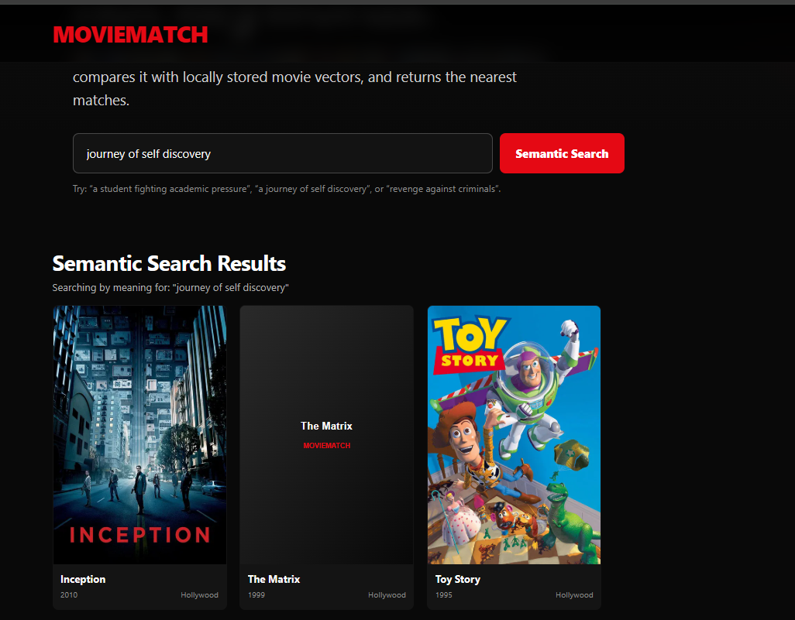
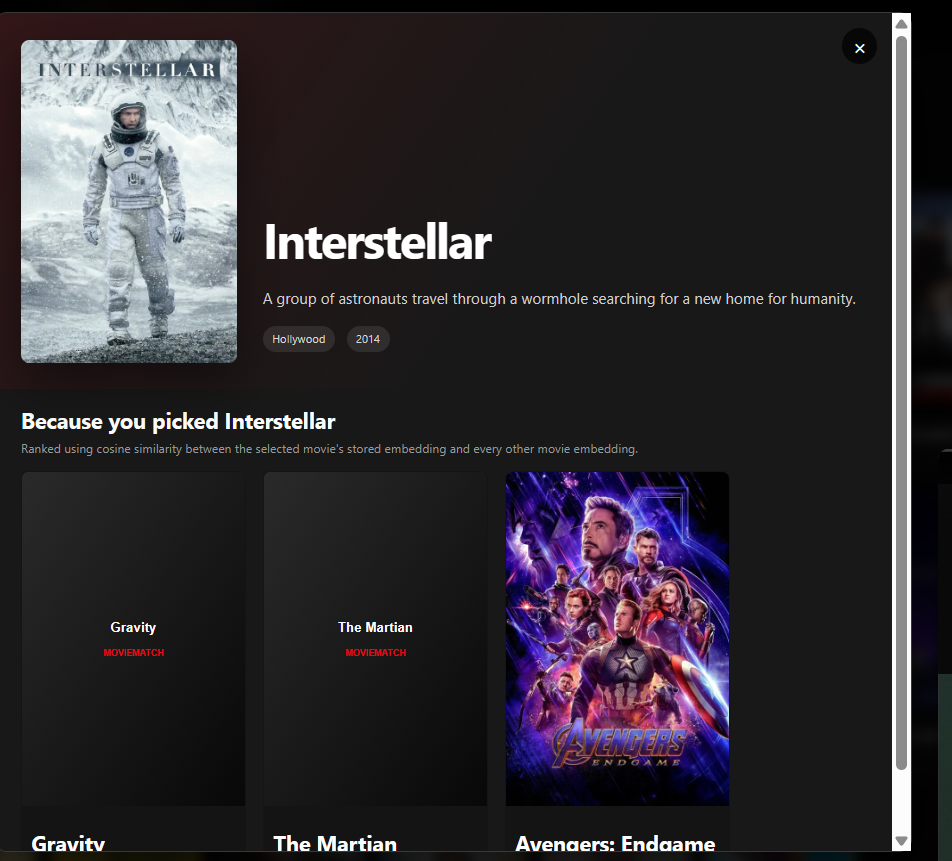

# 🎬 Netflix Recommendation Engine

An AI-powered movie recommendation engine built with **Spring Boot** and **Spring AI**. It uses a local **all-MiniLM-L6-v2** embedding model to understand the semantic meaning of movie descriptions and user queries.

The system provides **semantic movie search** and **related movie recommendations** using vector embeddings and cosine similarity.
## 🖼️ Screenshots

### 🔎 Semantic Movie Search

The application supports natural-language semantic search and returns movies based on the meaning of the query rather than exact keyword matching.



### 🎬 Related Movie Recommendations

Clicking a movie displays other movies with similar semantic descriptions using cosine similarity between their embeddings.


## ✨ Features

### 🔎 Semantic Movie Search

Users can search using natural-language queries rather than exact movie titles.

For example:

```text
"movies about space exploration"
```

The system converts the query into a vector embedding and compares it with movie embeddings using **cosine similarity** to find the most relevant movies.

### 🎬 Related Movies

When a user selects a movie, the system can find other movies with similar semantic descriptions.

```text
Selected Movie
      ↓
Movie Embedding
      ↓
Compare with Other Movies
      ↓
Cosine Similarity
      ↓
Top Related Movies
```

## 🏗️ Architecture

```text
                    ┌─────────────────┐
                    │    Frontend     │
                    │ HTML/CSS/JS     │
                    └────────┬────────┘
                             │
                             ▼
                    ┌─────────────────┐
                    │  Spring Boot    │
                    │    REST API     │
                    └────────┬────────┘
                             │
                             ▼
                    ┌─────────────────┐
                    │  Movie Service  │
                    └────────┬────────┘
                             │
                             ▼
                  ┌──────────────────────┐
                  │   Spring AI          │
                  │   EmbeddingModel     │
                  └──────────┬───────────┘
                             │
                             ▼
                  ┌──────────────────────┐
                  │ all-MiniLM-L6-v2     │
                  │ Local Embedding      │
                  │ Model                │
                  └──────────┬───────────┘
                             │
                             ▼
                  ┌──────────────────────┐
                  │ Movie Embeddings     │
                  │ float[384]            │
                  └──────────┬───────────┘
                             │
                             ▼
                  ┌──────────────────────┐
                  │ Cosine Similarity    │
                  └──────────┬───────────┘
                             │
                             ▼
                  ┌──────────────────────┐
                  │ Top-K Recommendations│
                  └──────────────────────┘
```

## 🧠 How It Works

### 1. Load Movie Data

Movie information is stored in:

```text
src/main/resources/movies.json
```

The application loads the movie data when Spring Boot starts.

### 2. Generate Movie Embeddings

For every movie, its description is passed to the local embedding model:

```text
Movie Description
       ↓
all-MiniLM-L6-v2
       ↓
384-dimensional vector
```

The embedding is stored with the movie in application memory.

### 3. Process User Search

When the user enters a search query:

```text
"movies about artificial intelligence"
```

the query is converted into a 384-dimensional embedding.

### 4. Calculate Similarity

The query embedding is compared with every movie embedding using **cosine similarity**.

The cosine similarity formula is:

```text
              A · B
Similarity = ─────────
             ||A|| ||B||
```

A higher similarity score means the two vectors are closer in direction.

### 5. Rank Results

Movies are sorted by their similarity score and the top results are returned to the frontend.

## 🛠️ Tech Stack

| Technology          | Purpose                         |
| ------------------- | ------------------------------- |
| Java 21             | Programming language            |
| Spring Boot 4.1.1   | Backend framework               |
| Spring AI 2.0.1     | AI/embedding abstraction        |
| Spring Web          | REST APIs and serving frontend  |
| all-MiniLM-L6-v2    | Local text embedding model      |
| ONNX                | Local model execution           |
| Jackson             | JSON parsing                    |
| Lombok              | Boilerplate reduction           |
| HTML/CSS/JavaScript | Frontend                        |
| Maven               | Build and dependency management |

## 📁 Project Structure

```text
Netflix_Recommendation_Engine/
│
├── src/
│   └── main/
│       ├── java/
│       │   └── in/
│       │       └── harsh/
│       │           └── netflix_recommendation_engine/
│       │               ├── Model/
│       │               │   ├── Movie.java
│       │               │   ├── MovieData.java
│       │               │   └── MovieMatch.java
│       │               │
│       │               ├── MovieController.java
│       │               ├── MovieService.java
│       │               └── NetflixRecommendationEngineApplication.java
│       │
│       └── resources/
│           ├── static/
│           │   ├── index.html
│           │   ├── style.css
│           │   └── script.js
│           │
│           ├── movies.json
│           └── application.properties
│
├── pom.xml
└── README.md
```

## ⚙️ Configuration

The project uses the local Transformers embedding model through Spring AI.

`application.properties`:

```properties
spring.application.name=Netflix_Recommendation_Engine

spring.ai.model.embedding=transformers

spring.ai.embedding.transformer.onnx.model-uri=https://huggingface.co/sentence-transformers/all-MiniLM-L6-v2/resolve/main/onnx/model.onnx

spring.ai.embedding.transformer.tokenizer.uri=https://huggingface.co/sentence-transformers/all-MiniLM-L6-v2/resolve/main/tokenizer.json
```

The model is downloaded and cached locally when the application initializes.

## 🚀 Running the Project

### 1. Clone the repository

```bash
git clone https://github.com/<your-username>/<your-repository>.git
```

### 2. Open the project

Open the project in IntelliJ IDEA or another Java IDE.

### 3. Build the project

```bash
mvn clean install
```

### 4. Run Spring Boot

Run:

```text
NetflixRecommendationEngineApplication
```

or:

```bash
mvn spring-boot:run
```

### 5. Open the frontend

Open:

```text
http://localhost:8080
```

## 🔌 API

### Semantic Search

```http
GET /api/movies/search?query=<your-query>
```

Example:

```text
/api/movies/search?query=space adventure
```

The API returns the most semantically relevant movies.

## 📊 Embedding Model

This project uses:

**sentence-transformers/all-MiniLM-L6-v2**

The model generates a **384-dimensional embedding** for each piece of text.

For example:

```text
Movie Description
       ↓
Embedding Model
       ↓
[-0.12, 0.43, 0.08, ...]
       ↓
384 values
```

The individual numbers are not treated as separate human-readable features. Together, they represent the semantic information captured by the embedding model.

## 💾 Data Storage

The current implementation intentionally uses **in-memory Java collections** for movie embeddings.

```java
List<Movie> moviesEmbedding = new ArrayList<>();
```

This keeps the project simple and makes the underlying recommendation algorithm easy to understand.

A dedicated vector database can be introduced later when scaling the application.

## 🔍 Recommendation Approach

This project uses **content-based recommendation**.

The recommendation process is:

```text
Movie / User Query
       ↓
Text Embedding
       ↓
Vector Representation
       ↓
Cosine Similarity
       ↓
Similarity Score
       ↓
Sorting
       ↓
Top-K Movies
```

No generative AI model is required for the current recommendation pipeline. The embedding model is used for converting text into numerical vectors.

## 🎯 Learning Outcomes

Through this project, I worked with:

* Spring Boot REST APIs
* Spring AI
* Local embedding models
* Hugging Face models
* ONNX model execution
* Text embeddings
* Vector representations
* Cosine similarity
* Semantic search
* Content-based recommendation
* JSON data processing
* Frontend-backend integration
* In-memory vector storage

## 🔮 Future Improvements

Possible future improvements include:

* Vector database integration
* Larger movie datasets
* Pagination
* Better filtering and ranking
* User-specific recommendation history
* Movie metadata filtering
* Recommendation caching
* Authentication and user profiles
* Production-ready deployment

## 👨‍💻 Author

**Harsh Tripathi**

B.Tech Computer Science & Engineering
PSIT, Kanpur

GitHub: `https://github.com/harsh-2093`
